# PixiDom

[](https://www.npmjs.com/package/pixidom.js)
[](https://opensource.org/licenses/MIT)
[](https://github.com/visgotti/PixiDom/actions/workflows/ci.yml)

A lightweight UI component library for [PixiJS](https://pixijs.com/) that provides DOM-like interactive elements. Build text inputs, buttons, toggles, sliders, and scrollable lists directly in your PixiJS applications.

## Features

* **Full PixiJS Integration** - Works seamlessly with PixiJS v4, v5, v6, v7, and v8
* **TextField** - Text input with cursor, selection, and keyboard handling
* **Button** - Customizable buttons with hover/pressed states
* **Slider** - Draggable value slider with customizable appearance
* **Toggle** - Animated toggle switches with labels
* **ScrollList** - Virtualized scrollable lists with optional scrollbar
* **BitmapText Support** - First-class support for bitmap fonts
* **Lightweight** - Zero dependencies beyond PixiJS

## Installation

```bash
npm install pixidom.js
# or
yarn add pixidom.js
# or
pnpm add pixidom.js
```

## Quick Start

### ES Modules (Recommended)

```javascript
import * as PIXI from 'pixi.js';
import { TextField, Button, Toggle, Slider, ScrollList, FontLoader } from 'pixidom.js';
```

### UMD (Browser)

```html
<script src="https://unpkg.com/pixi.js@8"></script>
<script src="https://unpkg.com/pixidom.js"></script>
<script>
  const { TextField, Button, Toggle } = PIXI_DOM;
</script>
```

## API Reference

### Color

Every component option that accepts a color is typed as `Color` and accepts any of these formats:

| Format | Example | Notes |
|---|---|---|
| Hex int | `0xe7e7e7` | Plain integer (0..0xffffff) |
| Hex string | `'#e7e7e7'`, `'#fff'`, `'#fff8'`, `'#e7e7e7ff'` | `#` optional; `0x` prefix also accepted; 3, 4, 6, or 8 digits |
| RGB(A) object | `{ r: 231, g: 231, b: 231 }` or `{ r: 231, g: 231, b: 231, a: 0.5 }` | Channels 0–255; alpha 0–1 (defaults to 1) |
| RGB(A) tuple | `[231, 231, 231]` or `[231, 231, 231, 0.5]` | Same channel ranges as the object form |

Channel values outside their valid ranges are **clamped** (e.g. `r: 300` → `255`). Malformed inputs (`'#zz'`, `null`, `{ r: 1 }` missing `g`/`b`) throw a `TypeError` so bugs surface during development.

Where a component also exposes a separate `*Opacity` option (e.g. `borderOpacity`, `backgroundOpacity`, `circleOutlineOpacity`), the alpha component of the color is **multiplied** with that opacity.

```javascript
import { normalizeColor, colorToInt } from 'pixidom.js';

// All of the following are equivalent:
normalizeColor(0xe7e7e7);            // { value: 0xe7e7e7, alpha: 1 }
normalizeColor('#e7e7e7');           // { value: 0xe7e7e7, alpha: 1 }
normalizeColor({ r: 231, g: 231, b: 231 });
normalizeColor([231, 231, 231]);

// With alpha:
normalizeColor('#e7e7e780');         // { value: 0xe7e7e7, alpha ≈ 0.5 }
normalizeColor({ r: 231, g: 231, b: 231, a: 0.5 });

// Strip alpha when only the integer is needed:
colorToInt('#ff000080');             // 0xff0000
```

### TextField

A fully-featured text input component with cursor navigation, text selection, and keyboard handling.

```javascript
import { TextField, FontLoader } from 'pixidom.js';

// Load bitmap font first
const fontLoader = new FontLoader();
fontLoader.add('myFont', './fonts/myFont.fnt');
fontLoader.load(() => {
  const textField = new TextField('myFont', {
    width: '300px',
    height: '32px',
    backgroundColor: 0xffffff,
    borderColor: 0x333333,
    borderWidth: 1,
    fontColor: 0x000000,
    cursorColor: 0x000000,
    xPadding: 5,
    yPadding: 5,
  });

  stage.addChild(textField);
});
```

#### TextField Options

| Option | Type | Default | Description |
|--------|------|---------|-------------|
| `width` | `string \| number` | `'500px'` | Width of the text field |
| `height` | `string \| number` | `'16px'` | Height of the text field |
| `backgroundColor` | `number` | `0xf7f7f7` | Background color (hex) |
| `borderColor` | `number` | `0x000000` | Border color (hex) |
| `borderWidth` | `number` | `1` | Border width in pixels |
| `fontColor` | `number` | `0x000000` | Text color (hex) |
| `cursorColor` | `number` | `0x000000` | Cursor color (hex) |
| `cursorWidth` | `number` | `1` | Cursor width in pixels |
| `cursorHeight` | `string \| number` | `'90%'` | Cursor height |
| `highlightedBackgroundColor` | `number` | `0x000080` | Selection highlight color |
| `highlightedFontColor` | `number` | `0xffffff` | Selected text color |
| `xPadding` | `number` | `0` | Horizontal padding |
| `yPadding` | `number` | `0` | Vertical padding |

#### TextField Methods

```javascript
// Focus/blur the text field
textField.focus();
textField.blur();

// Get/set text content
textField.change('New text');

// Clear the text field
textField.clear();

// Trigger submit action
textField.submit();

// Configure submit keys (default: Enter)
textField.submitKeyCodes = [13, 'Enter'];

// Configure keys to ignore
textField.ignoreKeys = [9]; // Ignore Tab

// Set maximum character length
textField.maxCharacterLength = 100;
```

#### TextField Events

```javascript
textField.onFocus(() => console.log('Focused'));
textField.onBlur(() => console.log('Blurred'));
textField.onChange((text) => console.log('Text changed:', text));
textField.onSubmit(() => console.log('Submitted'));
```

---

### Button

Interactive button component with customizable states for default, hover, and pressed appearances.

```javascript
import { Button } from 'pixidom.js';

const button = new Button('Click Me', {
  font: 'myFont',
  useBitmapText: true,
  defaultStyle: {
    width: 120,
    height: 40,
    backgroundColor: 0x4a90d9,
    textColor: 0xffffff,
    borderRadius: 25,
  },
  hoverStyle: {
    width: 120,
    height: 40,
    backgroundColor: 0x357abd,
    textColor: 0xffffff,
    borderRadius: 25,
  },
  pressedStyle: {
    width: 120,
    height: 40,
    backgroundColor: 0x2a5f8f,
    textColor: 0xffffff,
    borderRadius: 25,
  },
});

stage.addChild(button);
```

#### Button Style Options

| Option | Type | Description |
|--------|------|-------------|
| `width` | `number` | Button width |
| `height` | `number` | Button height |
| `textColor` | `number` | Text color (hex) |
| `backgroundColor` | `number` | Background color (hex) |
| `backgroundTexture` | `PIXI.Texture` | Background texture |
| `backgroundOpacity` | `number` | Background opacity (0-1) |
| `borderColor` | `number` | Border color (hex) |
| `borderWidth` | `number` | Border width in pixels |
| `borderOpacity` | `number` | Border opacity (0-1) |
| `borderRadius` | `number` | Border radius percentage (0-100) |

#### Button Methods

```javascript
// Update button text
button.text = 'New Label';

// Update style at runtime
button.updateStyle({ defaultStyle: { backgroundColor: 0xff0000 } });

// Event handlers (inherited from PixiElement)
button.onClick(() => console.log('Clicked!'));
button.onMouseOver(() => console.log('Hover'));
button.onMouseOut(() => console.log('Left'));
```

---

### Toggle

Animated toggle switch with optional labels and customizable animations.

```javascript
import { Toggle } from 'pixidom.js';

const toggle = new Toggle({
  width: 60,
  height: 30,
  borderRadius: 50,
  onBackgroundColor: 0x4cd964,
  offBackgroundColor: 0xe5e5e5,
  onCircleColor: 0xffffff,
  offCircleColor: 0xffffff,
  animationOptions: {
    type: 'linear',
    duration: 200,
  },
  labelOptions: {
    fontName: 'myFont',
    onLabel: 'ON',
    offLabel: 'OFF',
    onColor: 0xffffff,
    offColor: 0x666666,
  },
}, true); // Initial state: toggled on

stage.addChild(toggle);
```

#### Toggle Options

| Option | Type | Description |
|--------|------|-------------|
| `width` | `number` | Toggle width |
| `height` | `number` | Toggle height |
| `borderRadius` | `number` | Border radius percentage (0-100) |
| `onBackgroundColor` | `number` | Background color when ON |
| `offBackgroundColor` | `number` | Background color when OFF |
| `onCircleColor` | `number` | Circle color when ON |
| `offCircleColor` | `number` | Circle color when OFF |
| `backgroundOutline` | `{ width, color }` | Optional outline |
| `animationOptions` | `object` | Animation configuration |
| `labelOptions` | `object` | Optional text labels |

#### Toggle Events

```javascript
toggle.onToggle((isToggled) => {
  console.log('Toggle state:', isToggled);
});

// Get/set toggle state
console.log(toggle.toggled); // true or false
toggle.toggled = false;
```

---

### Slider

Draggable slider for numeric value selection with visual feedback.

```javascript
import { Slider } from 'pixidom.js';

const slider = new Slider({
  width: 200,
  height: 4,
  minValue: 0,
  maxValue: 100,
  startingValue: 50,
  activeColor: 0x4a90d9,
  inactiveColor: 0xcccccc,
  circleRadius: 8,
  circleColor: 0xffffff,
  circleOutlineWidth: 2,
  circleOutlineColor: 0x4a90d9,
  hover: {
    circleRadius: 10,
    circleOutlineWidth: 3,
  },
  down: {
    circleRadius: 12,
    circleColor: 0x4a90d9,
  },
});

stage.addChild(slider);
```

#### Slider Options

| Option | Type | Description |
|--------|------|-------------|
| `width` | `number` | Slider track width |
| `height` | `number` | Slider track height |
| `minValue` | `number` | Minimum value |
| `maxValue` | `number` | Maximum value |
| `startingValue` | `number` | Initial value |
| `activeColor` | `number` | Active (filled) track color |
| `inactiveColor` | `number` | Inactive track color |
| `circleRadius` | `number` | Handle radius |
| `circleColor` | `number` | Handle color |
| `circleOutlineWidth` | `number` | Handle outline width |
| `circleOutlineColor` | `number` | Handle outline color |
| `hover` | `object` | Style overrides on hover |
| `down` | `object` | Style overrides when pressed |

#### Slider Events

```javascript
slider.on('slider-change', (value) => {
  console.log('Slider value:', value);
});

// Get current value
console.log(slider.currentValue);
```

---

### ScrollList

Virtualized scrollable list with optional scrollbar, touch support, and mouse wheel scrolling.

```javascript
import { ScrollList } from 'pixidom.js';

const items = Array.from({ length: 100 }, (_, i) => {
  const container = new PIXI.Container();
  const text = new PIXI.Text(`Item ${i + 1}`, { fontSize: 16 });
  container.addChild(text);
  return { container };
});

const scrollList = new ScrollList(
  {
    width: '300px',
    height: '400px',
    backgroundColor: 0xffffff,
    dividerColor: 0xeeeeee,
    dividerPixelHeight: 1,
    dividerPercentWidth: 100,
    dividerTopPadding: 5,
    dividerBottomPadding: 5,
    xPadding: 10,
    yPadding: 10,
    scrollBarOptions: {
      width: 8,
      backgroundColor: 0xe0e0e0,
      scrollerColor: 0x888888,
      borderRadius: 50,
    },
  },
  items
);

stage.addChild(scrollList);
```

#### ScrollList Performance Options

```javascript
const scrollList = new ScrollList(styleOptions, items, {
  disableScrollWheelScroll: false,
  disableTouchScroll: false,
  visibilityBuffer: 200, // Pixels of buffer for virtualization
  adjustVisibilityTime: 130,
});
```

---

### PixiElement

Base class for interactive elements with event handling, drag support, and swipe gestures.

```javascript
import { PixiElement } from 'pixidom.js';

const element = new PixiElement();

// Mouse events
element.onMouseDown((event) => {});
element.onMouseUp((event) => {});
element.onMouseOver((event) => {});
element.onMouseOut((event) => {});
element.onClick((event) => {});

// Drag events
element.onDragStart((event) => {}, holdTime);
element.onDragMove((event) => {});
element.onDragEnd((event) => {});

// Swipe gestures
element.onSwipe((direction, velocity) => {});

// Centering utilities
element.center();
element.centerX();
element.centerY();
```

---

### FontLoader

Cross-version bitmap font loader that works with PixiJS v4-v8.

```javascript
import { FontLoader } from 'pixidom.js';

const fontLoader = new FontLoader();
fontLoader.add('small', './fonts/small.fnt');
fontLoader.add('medium', './fonts/medium.fnt');
fontLoader.load(() => {
  console.log('Fonts loaded!');
  // Now you can use the fonts with TextField, Button, etc.
});
```

---

### Utility Functions

```javascript
import { 
  utils,
  getPixiVersion,
  resolvePixiRenderer,
  renderContainer,
  createBitmapText,
  ensurePixiCanvasFallback,
} from 'pixidom.js';

// Get current PixiJS version
const version = getPixiVersion(); // e.g., 8

// Create a renderer (handles version differences)
const renderer = await resolvePixiRenderer({
  width: 800,
  height: 600,
  canvas: document.getElementById('canvas'),
});

// Render a container
renderContainer(renderer, stage);

// Center a PixiJS object within its parent
utils.centerPixiObject(sprite);

// Convert color string to hex
const hex = utils.string2hex('#ff0000'); // 0xff0000

// Normalize any Color input to a { value, alpha } pair
utils.normalizeColor('#ff000080'); // { value: 0xff0000, alpha ≈ 0.5 }
utils.normalizeColor({ r: 255, g: 0, b: 0 }); // { value: 0xff0000, alpha: 1 }
utils.colorToInt([255, 0, 0, 0.5]); // 0xff0000 (alpha discarded)
```

## 🧪 Development

### Setup

```bash
git clone https://github.com/visgotti/PixiDom.git
cd PixiDom
npm install
```

### Scripts

```bash
# Start development server
npm run dev

# Build the library
npm run build

# Run unit tests
npm test

# Run E2E tests (Playwright)
npm run test:e2e

# Update E2E snapshots
npm run test:e2e:update

# Serve examples locally
npm run serve:examples

# Generate documentation
npm run docs
```

### Running Examples

```bash
npm run serve:examples
```

Then open `http://localhost:4173` in your browser to see all component demos.

## 🔧 PixiJS Version Compatibility

PixiDom automatically adapts to the version of PixiJS you're using:

| PixiJS Version | Status |
|----------------|--------|
| v4.x | ✅ Supported |
| v5.x | ✅ Supported |
| v6.x | ✅ Supported |
| v7.x | ✅ Supported |
| v8.x | ✅ Supported |

### How it picks up your PixiJS

PixiDom imports `pixi.js` through a peer dependency, so whichever version you install is the one it uses. There is **no init step**, no `window.PIXI = PIXI` hand-off, and no version-specific configuration. Importing the package once is enough:

```ts
import { Button } from 'pixidom.js';
```

For UMD `<script>` users, load your PixiJS UMD bundle first (any of v4–v8), then `pixidom.js` — `window.PIXI` is detected automatically.

### Caveats by version

- **v8 (modular ESM)**: `import { Button } from 'pixidom.js'` works directly. You do **not** need to import `pixi.js/app`, `pixi.js/graphics`, etc. — PixiDom's bootstrap loads the main `pixi.js` entry, which already re-exports the full surface.
- **v8 with strict ESM**: ES module namespaces are frozen, so PixiDom copies the imported `pixi.js` into a mutable `globalThis.PIXI` for legacy `PIXI.X` consumers. Your own `import * as PIXI from 'pixi.js'` is unaffected — it still resolves to the same module instance via peer-dep hoisting.
- **v7 → v8 migration**: Some shape changes are smoothed over by the adapter (`Application.init()`, `events.setTargetElement`, the Graphics fluent API). Cross-version code using PixiDom should not need version branches; if you hit one, file an issue.
- **v4 (CJS-only)**: Loaders are pre–`Assets`. Use `getPixiLoader()` / `newPixiLoader()` from PixiDom rather than reaching for `PIXI.Loader` directly — the adapter normalizes the v4 vs v5+ vs v7+ loader differences.
- **v4–v6 Graphics fluent API** (`beginFill` / `drawRect` / `endFill`) and **v8 fluent API** (`rect().fill()`) are both supported. PixiDom installs a small compatibility shim on `Graphics.prototype` so your component code can use either form regardless of installed version.
- **Multiple PixiJS versions in your dependency tree**: if your bundler resolves more than one copy of `pixi.js`, `globalThis.PIXI` will point at whichever copy PixiDom resolved, which may differ from the one your app code imported. This is the standard peer-dep hazard — pin a single `pixi.js` version in your root `package.json` to avoid it.
- **TypeScript types**: PixiDom ships its own version-agnostic `PIXI` namespace shim. If you want strict v8 types in your own code, `import * as PIXI from 'pixi.js'` directly — both can coexist.

### Visual Parity Across Versions

Every component is exercised by Playwright against PixiJS v4 through v8 with a 97% pixel-match threshold. The current baselines:

<!-- SNAPSHOT_REPORT_START -->

<!-- This block is auto-generated by `npm run snapshot-report:readme`. Do not edit by hand. -->

### Button

| State | pixi4 | pixi5 | pixi6 | pixi7 | pixi8 |
| --- | :---: | :---: | :---: | :---: | :---: |
| Default | 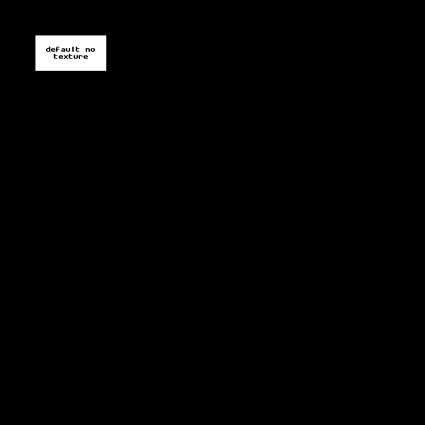 |  | 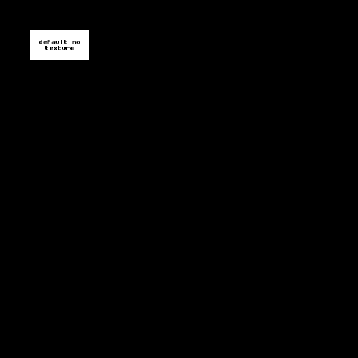 |  |  |

### Element

| State | pixi4 | pixi5 | pixi6 | pixi7 | pixi8 |
| --- | :---: | :---: | :---: | :---: | :---: |
| Default |  |  | 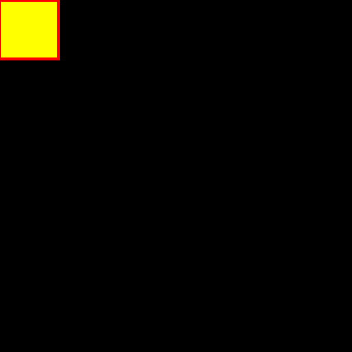 |  | 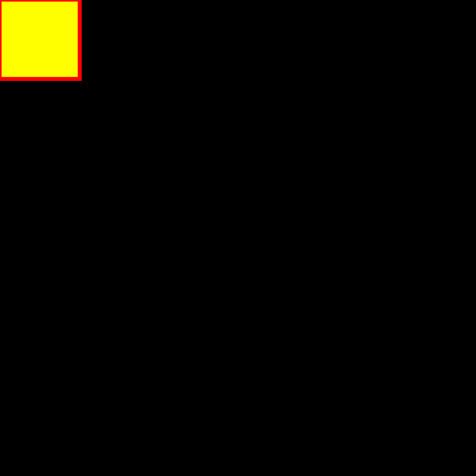 |

### ScrollList (with scrollbar)

| State | pixi4 | pixi5 | pixi6 | pixi7 | pixi8 |
| --- | :---: | :---: | :---: | :---: | :---: |
| After Scroll |  | 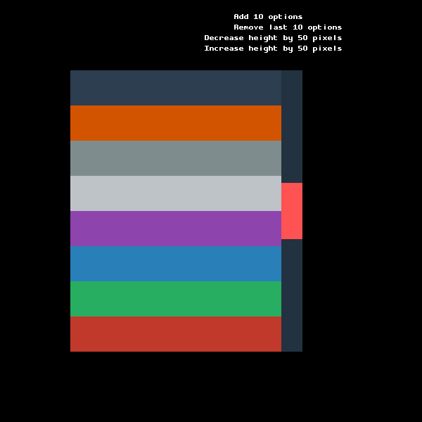 |  |  | 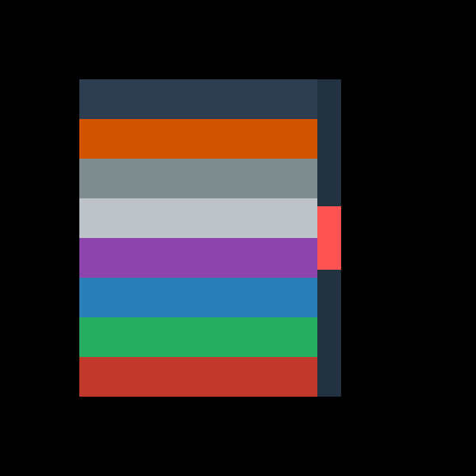 |
| Before Scroll |  | 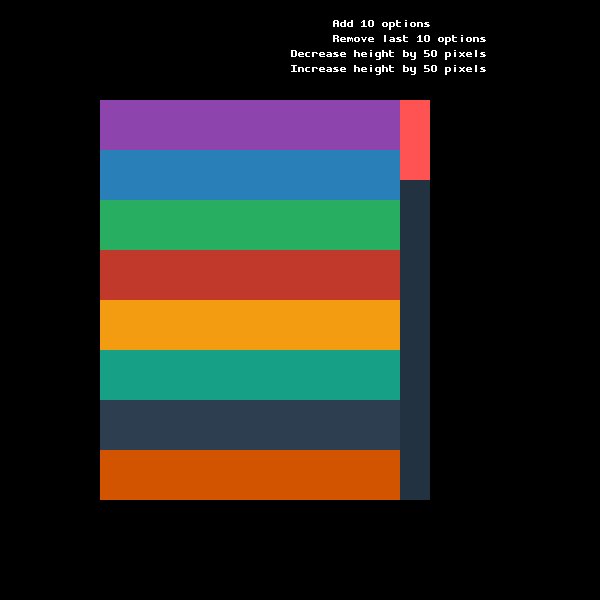 | 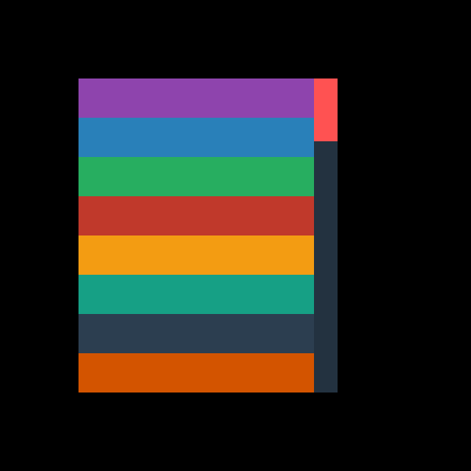 |  |  |

### ScrollList (without scrollbar)

| State | pixi4 | pixi5 | pixi6 | pixi7 | pixi8 |
| --- | :---: | :---: | :---: | :---: | :---: |
| After Scroll |  | 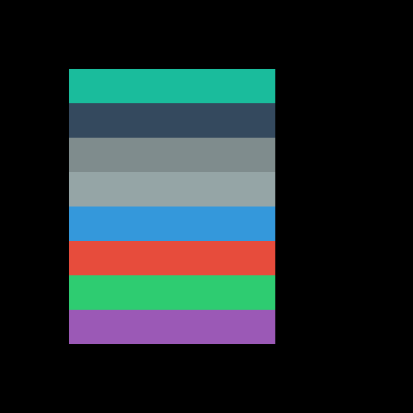 |  |  |  |
| Before Scroll |  |  |  |  | 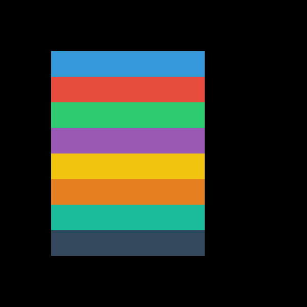 |

### Slider

| State | pixi4 | pixi5 | pixi6 | pixi7 | pixi8 |
| --- | :---: | :---: | :---: | :---: | :---: |
| Default | 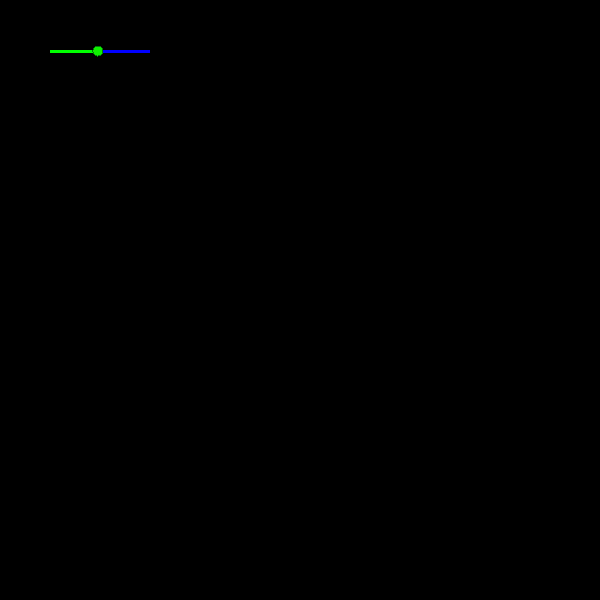 |  |  |  |  |

### TextField

| State | pixi4 | pixi5 | pixi6 | pixi7 | pixi8 |
| --- | :---: | :---: | :---: | :---: | :---: |
| After | 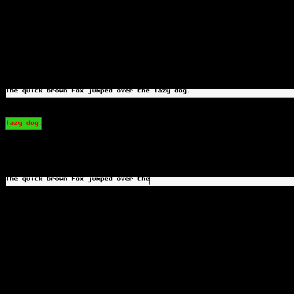 |  |  |  | 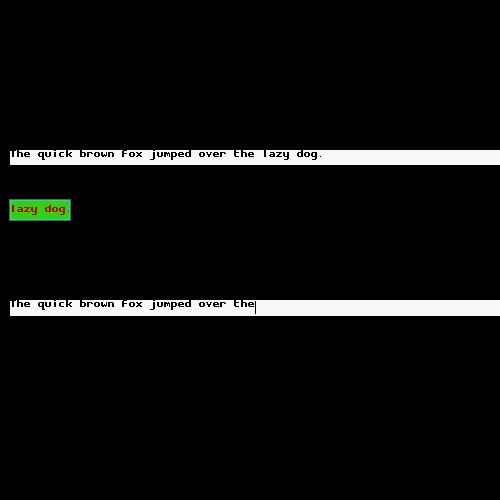 |
| After Backspace |  |  |  | 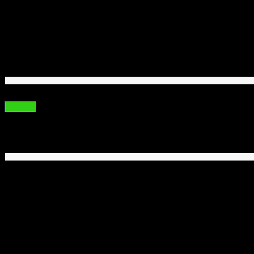 |  |
| Before |  |  |  |  | 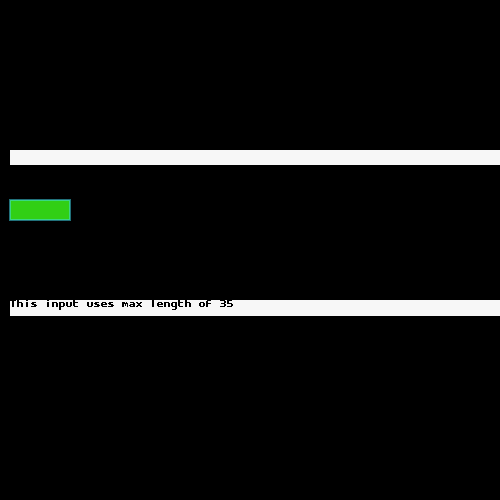 |
| Select All |  |  |  | 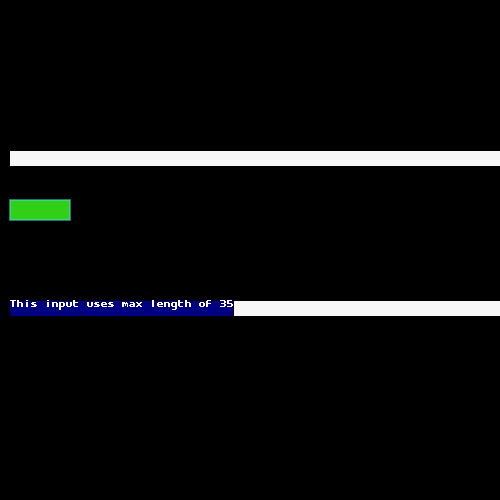 |  |

### Toggle

| State | pixi4 | pixi5 | pixi6 | pixi7 | pixi8 |
| --- | :---: | :---: | :---: | :---: | :---: |
| After |  |  |  |  | 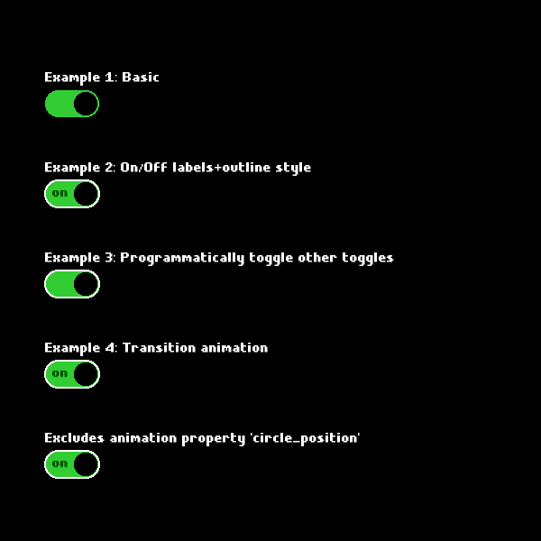 |
| Before |  |  | 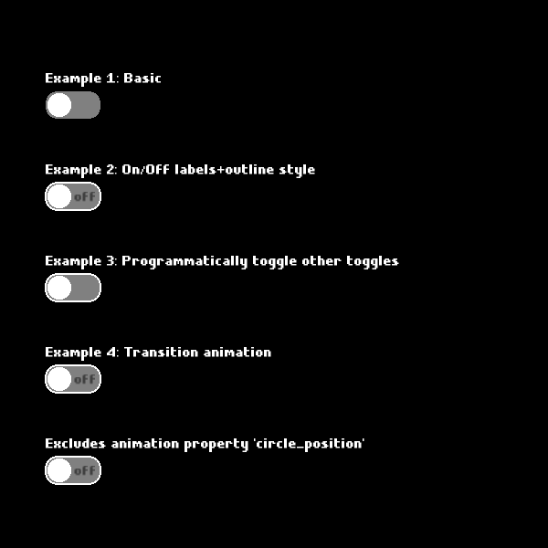 | 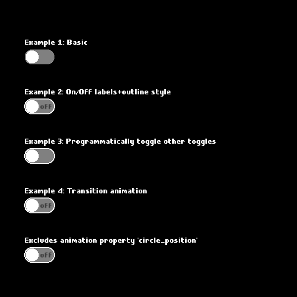 | 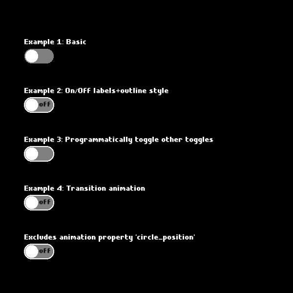 |

<!-- SNAPSHOT_REPORT_END -->

> Run `npm run snapshot-report:readme` to regenerate this section after updating snapshots.

## 📄 TypeScript Support

PixiDom is written in TypeScript and includes full type definitions. Import types directly:

```typescript
import type { 
  ButtonStyleOptions,
  ToggleOptions,
  ScrollStyleOptions,
  StyleOptionsParams,
} from 'pixidom.js';
```

## 🤝 Contributing

Contributions are welcome! Please read our [Contributing Guide](CONTRIBUTING.md) for details.

1. Fork the repository
2. Create your feature branch (`git checkout -b feature/amazing-feature`)
3. Commit your changes (`git commit -m 'Add amazing feature'`)
4. Push to the branch (`git push origin feature/amazing-feature`)
5. Open a Pull Request

## 📝 License

This project is licensed under the MIT License - see the [LICENSE](LICENSE) file for details.

## 🔗 Links

- [GitHub Repository](https://github.com/visgotti/PixiDom)
- [NPM Package](https://www.npmjs.com/package/pixidom.js)
- [API Documentation](https://visgotti.github.io/PixiDom/docs)
- [Live Demo](https://visgotti.github.io/PixiDom)
- [Issue Tracker](https://github.com/visgotti/PixiDom/issues)

